# Learning 3D Scene Priors with 2D Supervision [[Project]](https://yinyunie.github.io/sceneprior-page/)[[Paper]](https://arxiv.org/pdf/2211.14157.pdf)

[Yinyu Nie](https://yinyunie.github.io/), [Angela Dai](https://www.3dunderstanding.org/), [Xiaoguang Han](https://gaplab.cuhk.edu.cn/), [Matthias Nießner](https://niessnerlab.org/index.html)

in [CVPR 2023](https://cvpr2023.thecvf.com/)

---

**3D Scene Generation**

| 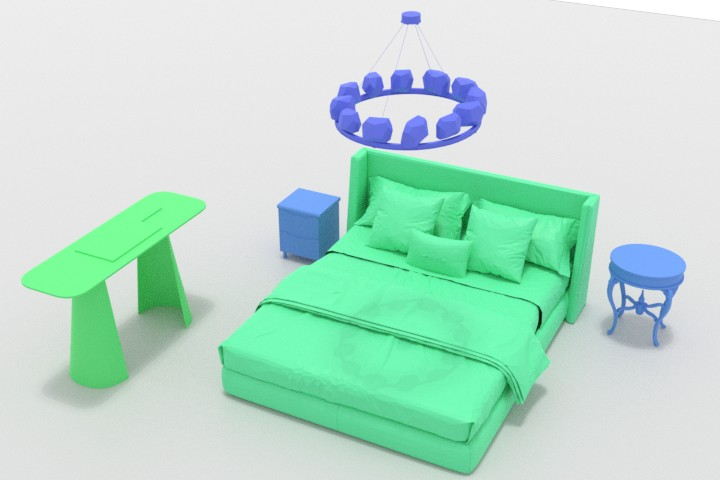 | 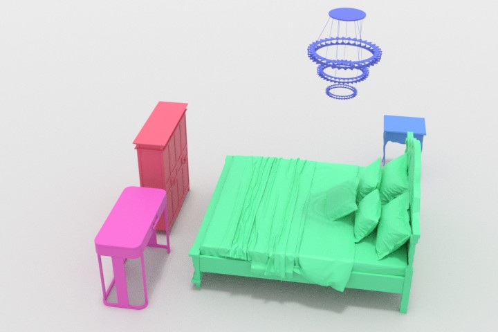 |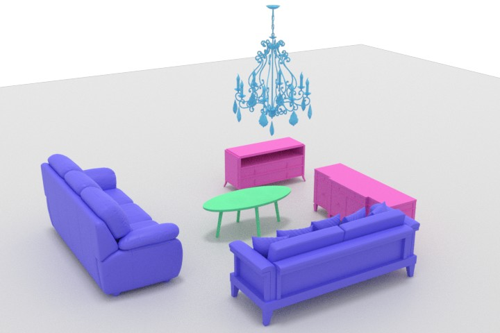 | 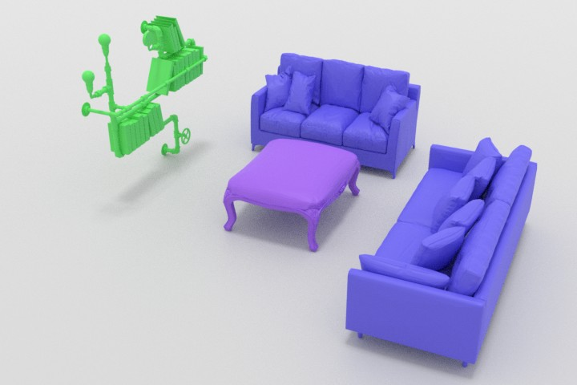 |
|:-----------------------------------------------------------:|:-----------------------------------------------------------:|:-----------------------------------------------------------:|:-----------------------------------------------------------:| 


**Single View Reconstruction**

|                       Input                       |                        Pred                         |                       Input                       |                       Pred                       |
|:-------------------------------------------------:|:---------------------------------------------------:|:-------------------------------------------------:|:------------------------------------------------:|
| 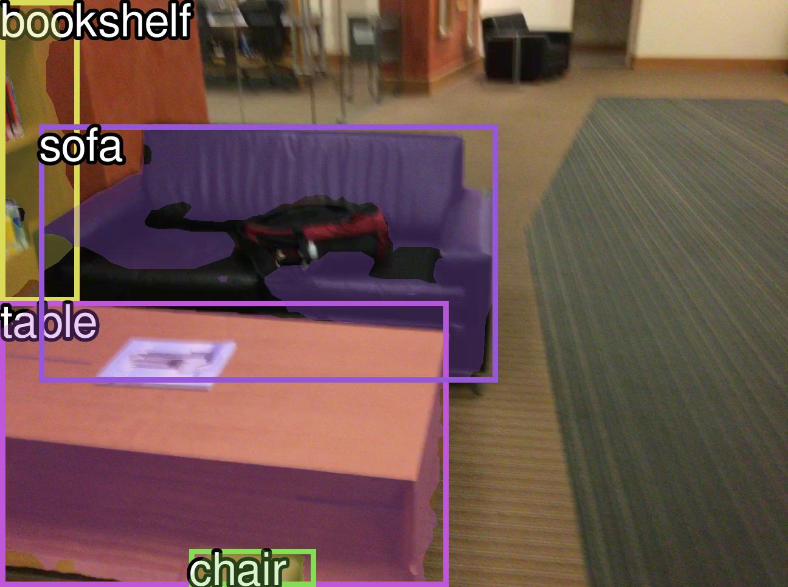 |  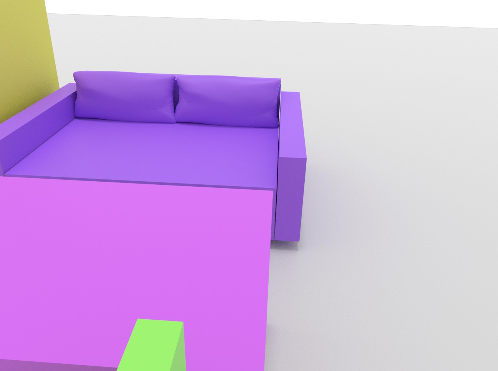   | 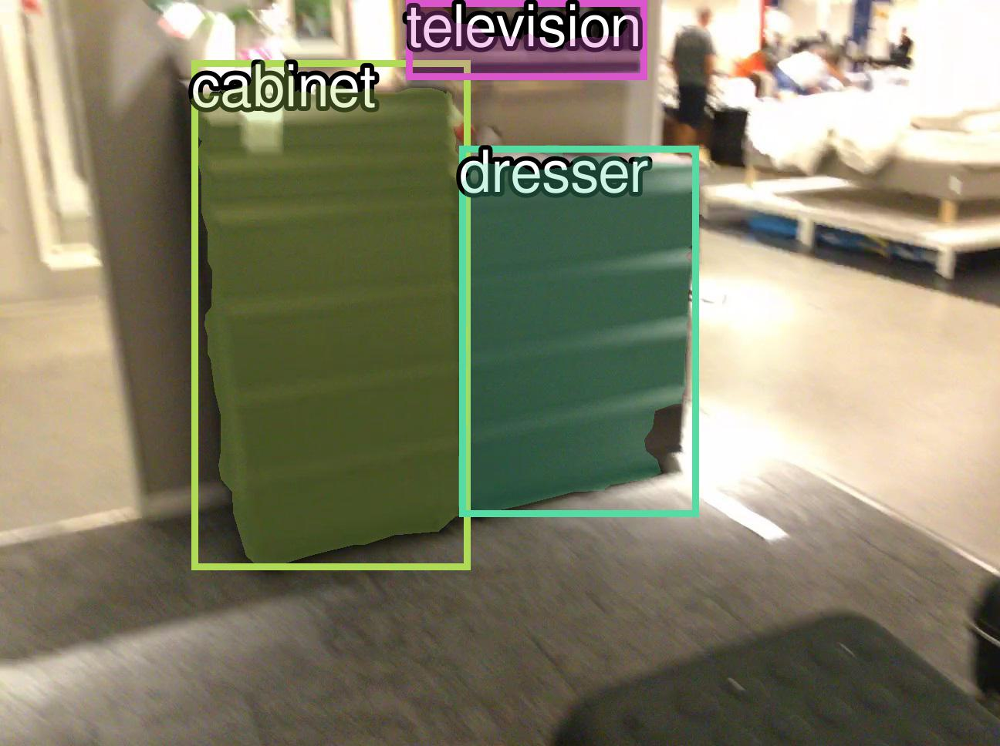 | 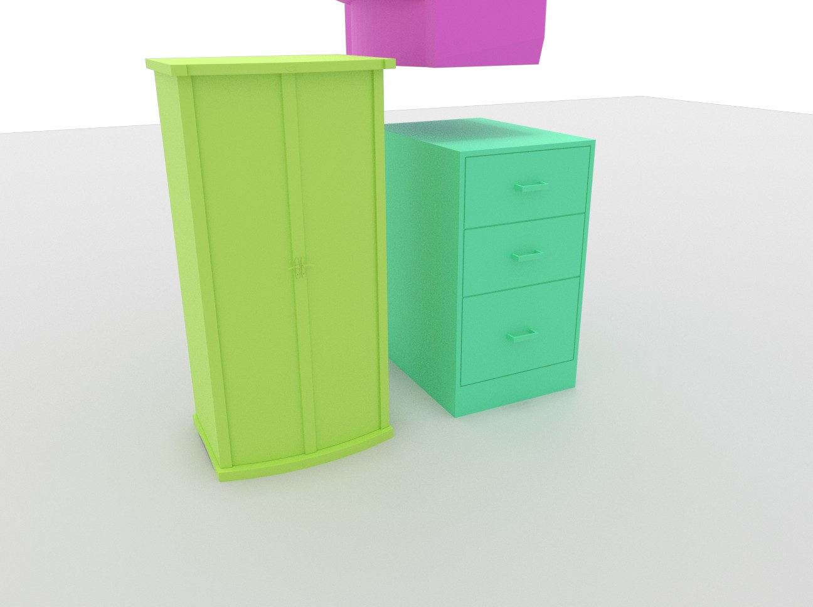 |
 ---

## Install
Our codebase is developed under Ubuntu 20.04 with PyTorch 1.12.1.
1. We recommend to use [conda]() to deploy our environment by
    ```commandline
    cd ScenePriors
    conda create env -f environment.yml
    conda activate sceneprior
    ```

2. Install [Fast Transformers](https://fast-transformers.github.io/) by
   ```commandline
   cd external/fast_transformers
   python setup.py build_ext --inplace
   cd ../..
   ```

3. Please follow [link](https://github.com/facebookresearch/pytorch3d/blob/main/INSTALL.md) to install the prerequisite libraries for [PyTorch3D](https://pytorch3d.org/). Then install PyTorch3D from our local clone by
   ```commandline
   cd external/pytorch3d
   pip install -e .
   cd ../..
   ```
   *Note: After installed all prerequisite libraries in [link](https://github.com/facebookresearch/pytorch3d/blob/main/INSTALL.md), please do not install prebuilt binaries for PyTorch3D.*  
---

## Data Processing
### 3D-Front data processing (for scene genration)
1. Apply \& Download the [3D-Front](https://tianchi.aliyun.com/specials/promotion/alibaba-3d-scene-dataset) dataset and link them to the local directory as follows:
   ```
   datasets/3D-Front/3D-FRONT
   datasets/3D-Front/3D-FRONT-texture
   datasets/3D-Front/3D-FUTURE-model
   ```
   
2. Render 3D-Front scenes following my [rendering pipeline](https://github.com/yinyunie/BlenderProc-3DFront) and link the rendering results (in `renderings` folder) to
   ```
   datasets/3D-Front/3D-FRONT_renderings_improved_mat
   ```
   *Note: you can comment out `bproc.renderer.enable_depth_output(activate_antialiasing=False)` in `render_dataset_improved_mat.py` since we do not need depth information.*

3. Preprocess 3D-Front data by
   ```commandline
   python utils/threed_front/1_process_viewdata.py --room_type ROOM_TYPE --n_processes NUM_THREADS
   python utils/threed_front/2_get_stats.py --room_type ROOM_TYPE
   ```
   * The processed data for training are saved in `datasets/3D-Front/3D-FRONT_samples`.
   * We also parsed and extracted the 3D-Front data for visualization into `datasets/3D-Front/3D-FRONT_scenes`.
   * `ROOM_TYPE` can be `'bed'`(bedroom) or `'living'`(living room).
   * You can set `NUM_THREADS` to your CPU core number for parallel processing.

4. Visualize processed data for verification by (optional)
   ```commandline
   python utils/threed_front/vis/vis_gt_sample.py --scene_json SCENE_JSON_ID --room_id ROOM_ID --n_samples N_VIEWS 
   ```
   * `SCENE_JSON_ID` is the ID of a scene, e,g, `6a0e73bc-d0c4-4a38-bfb6-e083ce05ebe9`.
   * `ROOM_ID` is the room ID in this scene, e.g., `MasterBedroom-2679`.
   * `N_VIEWS` is the number views to visualize., e.g. `12`.
   
   If everything goes smooth, there will pop five visualization windows as follows.

|               <div style="width:200px">RGB</div>                |                     <div style="width:200px">Semantics</div>                      |             <div style="width:200px">Instances</div>             |            <div style="width:200px">3D Box Projections</div>             |          <div style="width:200px">CAD Models (view #1)</div>           |
|:---------------------------------------------------------------:|:---------------------------------------------------------------------------------:|:----------------------------------------------------------------:|:------------------------------------------------------------------------:|:----------------------------------------------------------------------:|
| 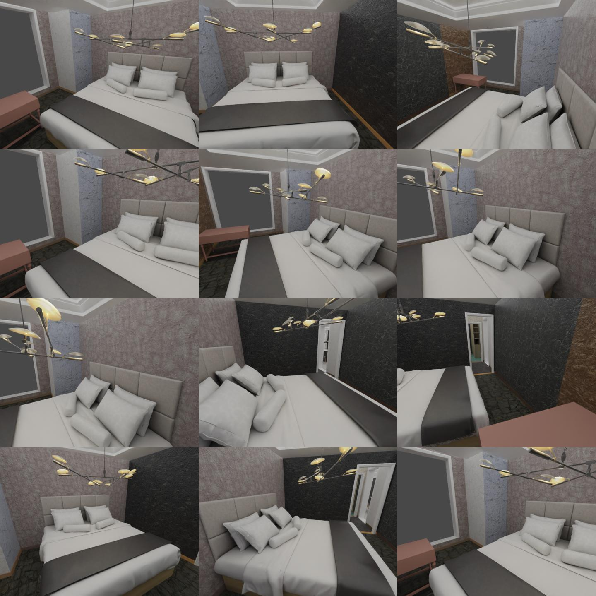 |          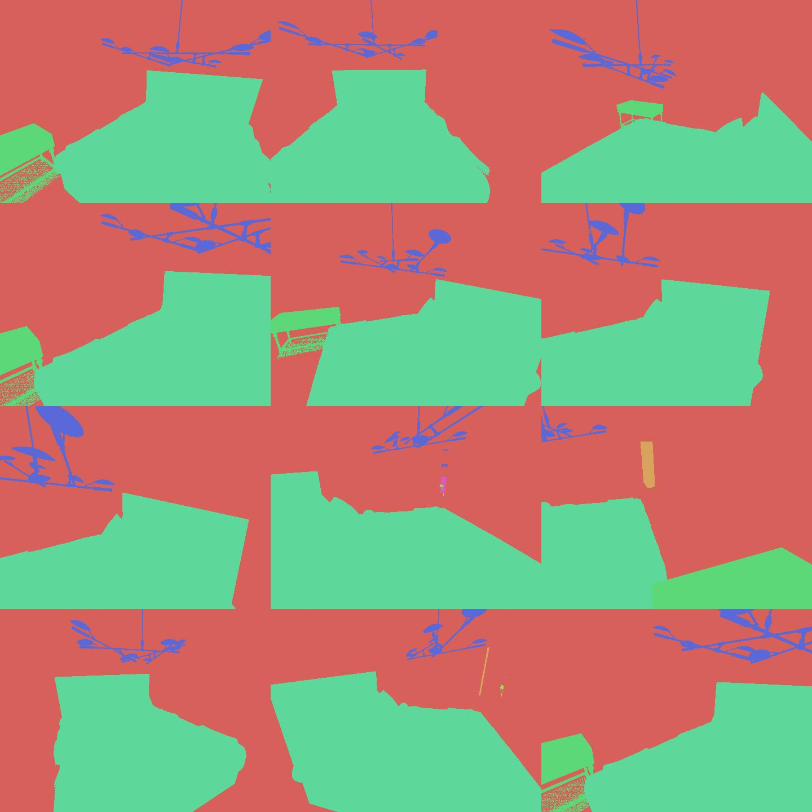          | 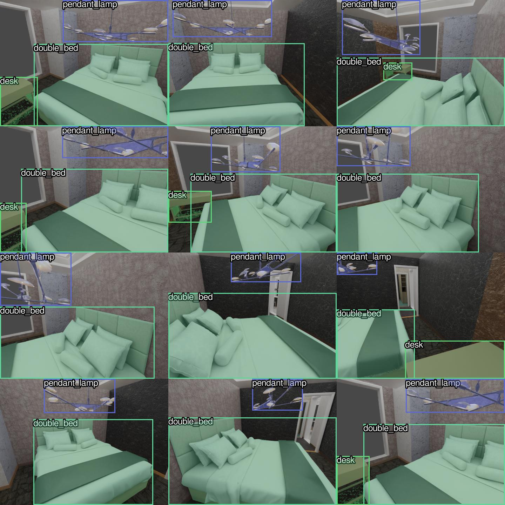 | 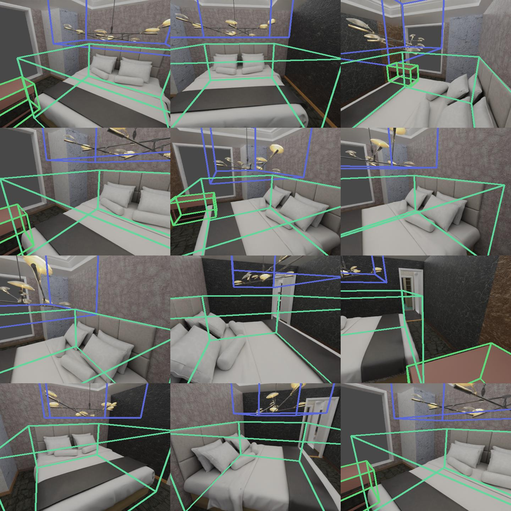  | 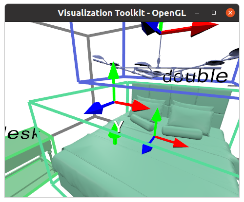 |

*Note: X server is required for visualization.*

### ScanNet data processing (for single-view reconstruction)
1. Apply and download [ScanNet](http://www.scan-net.org/) into `datasets/ScanNet/scans`. Since we need 2D data, the `*.sens` should also be downloaded for each scene.
2. Extract `*.sens` files to obtain RGB/semantics/instance/camera pose frame data by
   ```commandline
   python utils/scannet/1_unzip_sens.py
   ```
   Then the folder structure in each scene looks like:
   ```
   ./scene*
   |--color (folder)
   |--instance-filt (folder)
   |--intrinsic (folder)
   |--label-filt (folder)
   |--pose (folder)
   |--scene*.aggregation.json
   |--scene*.sens
   |--scene*.txt
   |--scene*_2d-instance.zip
   ...
   |--scene*_vh_clean_2.ply
   ```
3. Process ScanNet data by
   ```commandline
   python utils/scannet/2_process_viewdata.py
   ```
   The processed data will be saved in `datasets/ScanNet/ScanNet_samples`.

4. Visualize the processed data by(optional)
   ```commandline
   python utils/scannet/vis/vis_gt.py --scene_id SCENE_ID --n_samples N_SAMPLES
   ```
   * SCENE_ID is the scene ID in scannet, e.g., `scene0000_00`
   * N_SAMPLES is the number of views to visualize, e.g., `6` 
   
   If everything goes smooth, it will pop out five visualization windows like

|               <div style="width:200px">RGB</div>                |            <div style="width:200px">Semantics</div>             |             <div style="width:200px">Instances</div>             |            <div style="width:200px">3D Box Projections</div>            |          <div style="width:200px">3D Boxes (view #3)</div>          |
|:---------------------------------------------------------------:|:---------------------------------------------------------------:|:----------------------------------------------------------------:|:-----------------------------------------------------------------------:|:-------------------------------------------------------------------:|
| 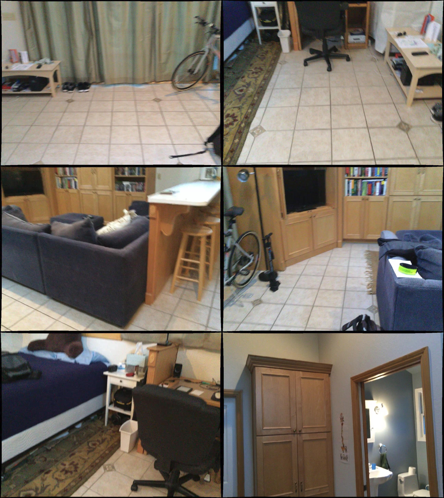 |  | 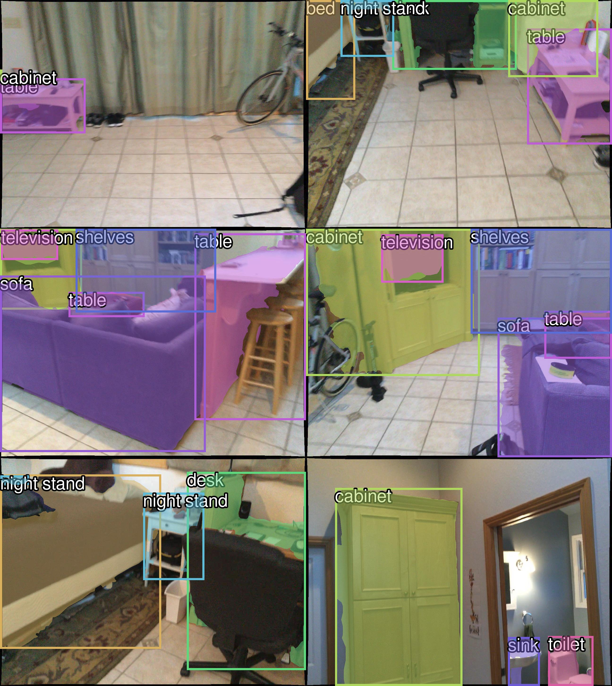 | 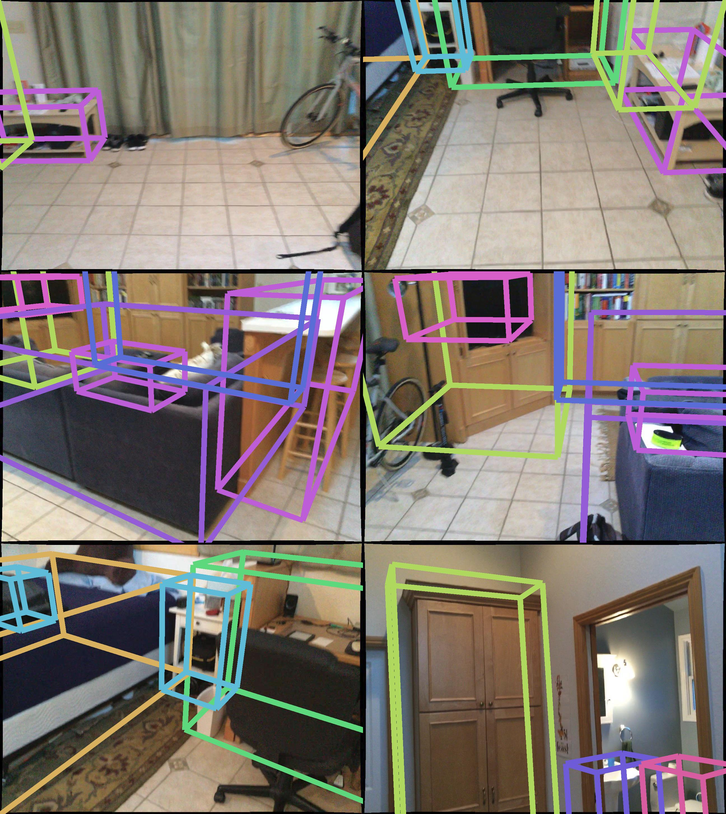 | 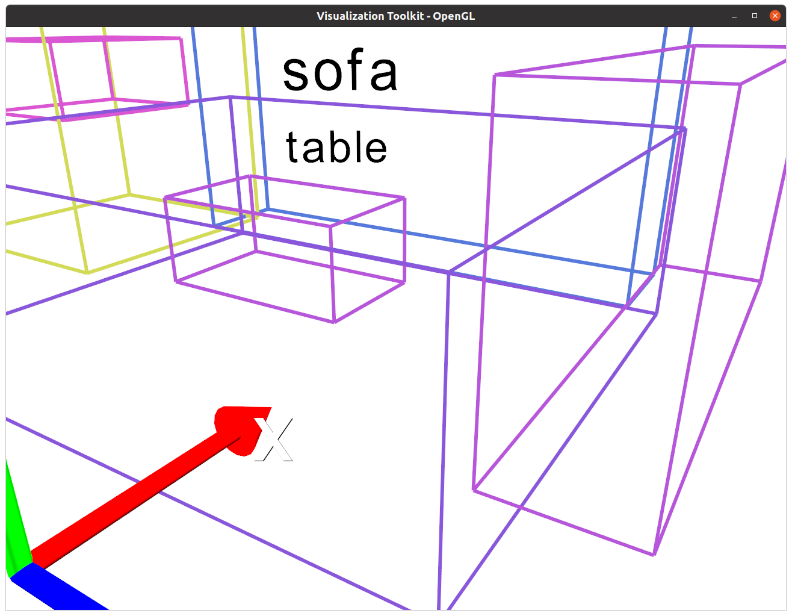 |

*Note: X server is required for visualization.*

---

## Training
*Note: we use SLURM to manage multi-GPU training. For backend setting, please check [slurm_jobs](slurm_jobs).*

### Scene Generation (with 3D-Front)
Here we use bedroom data as an example. Training on living rooms is the same.

1. Start layout pretraining by
   ```commandline
   python main.py \
       start_deform=False \
       resume=False \
       finetune=False \
       weight=[] \
       distributed.num_gpus=4 \
       data.dataset=3D-Front \
       data.split_type=bed \
       data.n_views=20 \
       data.aug=False \
       device.num_workers=32 \
       train.batch_size=128 \
       train.epochs=800 \
       train.freeze=[] \
       scheduler.latent_input.milestones=[400] \
       scheduler.generator.milestones=[400] \
       log.if_wandb=True \
       exp_name=pretrain_3dfront_bedroom
   ```
   The network weight will be saved in `outputs/3D-Front/train/YEAR-MONTH-DAY/HOUR-MINUTE-SECOND/model_best.pth`. 
2. Shape training - We start shape training after the layout training converged. Please replace the `weight` keyword below with the pretrained weight path.
   ```commandline
   python main.py \
       start_deform=True \
       resume=False \
       finetune=True \
       weight=['outputs/3D-Front/train/YEAR-MONTH-DAY/HOUR-MINITE-SECOND/model_best.pth'] \
       distributed.num_gpus=4 \
       data.dataset=3D-Front \
       data.n_views=20 \
       data.aug=False \
       data.downsample_ratio=4 \
       device.num_workers=16 \
       train.batch_size=16 \
       train.epochs=500 \
       train.freeze=[] \
       scheduler.latent_input.milestones=[300] \
       scheduler.generator.milestones=[300] \
       log.if_wandb=True \
       exp_name=train_3dfront_bedroom
   ```
   Still, the refined network weight will be saved in `outputs/3D-Front/train/YEAR-MONTH-DAY/HOUR-MINUTE-SECOND/model_best.pth`.

### Single-view Reconstruction (with ScanNet)
1. Start layout pretraining by
   ```commandline
   python main.py \
       start_deform=False \
       resume=False \
       finetune=False \
       weight=[] \
       distributed.num_gpus=4 \
       data.dataset=ScanNet \
       data.split_type=all \
       data.n_views=40 \
       data.aug=True \
       device.num_workers=32 \
       train.batch_size=64 \
       train.epochs=500 \
       train.freeze=[] \
       scheduler.latent_input.milestones=[500] \
       scheduler.generator.milestones=[500] \
       log.if_wandb=True \
       exp_name=pretrain_scannet
   ```
   The network weight will be saved in `outputs/ScanNet/train/YEAR-MONTH-DAY/HOUR-MINUTE-SECOND/model_best.pth`.

2. Shape training - We start shape training after the layout training converged. Please replace the weight keyword below with the pretrained weight path.
```commandline
   python main.py \
       start_deform=True \
       resume=False \
       finetune=True \
       weight=['outputs/ScanNet/train/YEAR-MONTH-DAY/HOUR-MINUTE-SECOND/model_best.pth'] \
       distributed.num_gpus=4 \
       data.dataset=ScanNet \
       data.split_type=all \
       data.n_views=40 \
       data.downsample_ratio=4 \
       data.aug=True \
       device.num_workers=8 \
       train.batch_size=8 \
       train.epochs=500 \
       train.freeze=[] \
       scheduler.latent_input.milestones=[300] \
       scheduler.generator.milestones=[300] \
       log.if_wandb=True \
       exp_name=train_scannet
   ```
   Still, the refined network weight will be saved in `outputs/ScanNet/train/YEAR-MONTH-DAY/HOUR-MINUTE-SECOND/model_best.pth`.

## Generation
   
